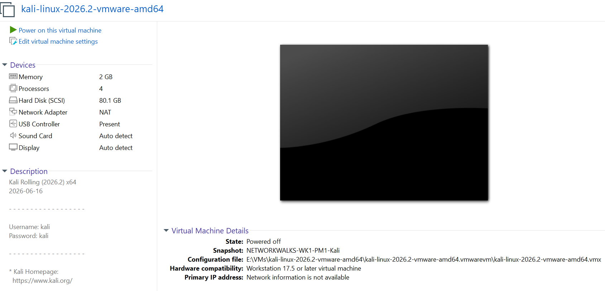
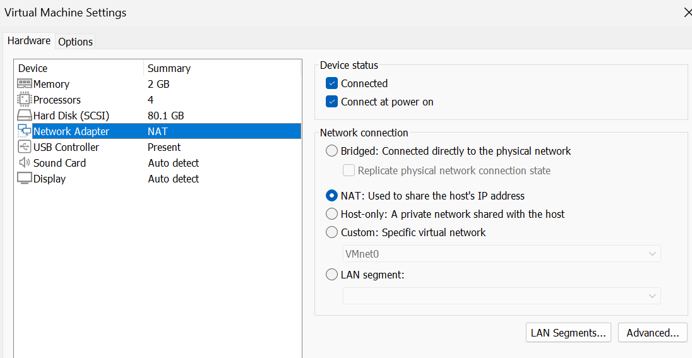
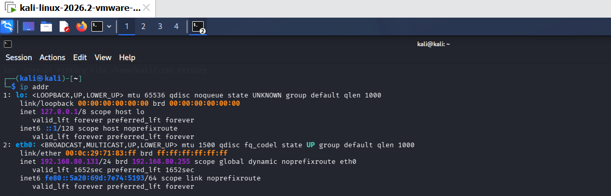
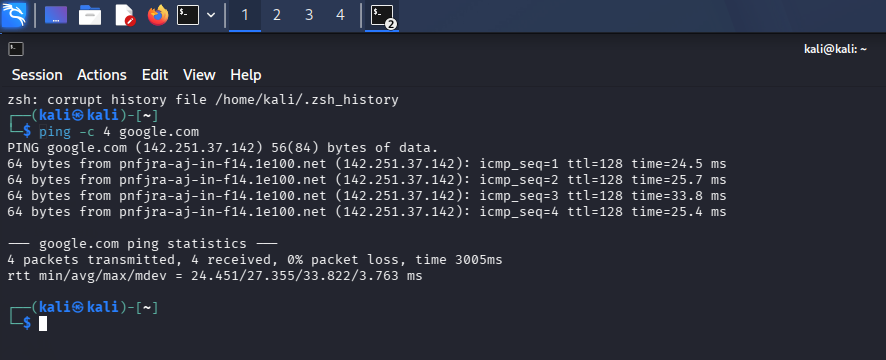
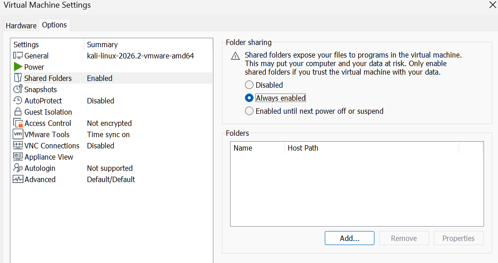
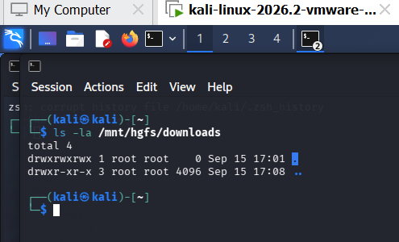
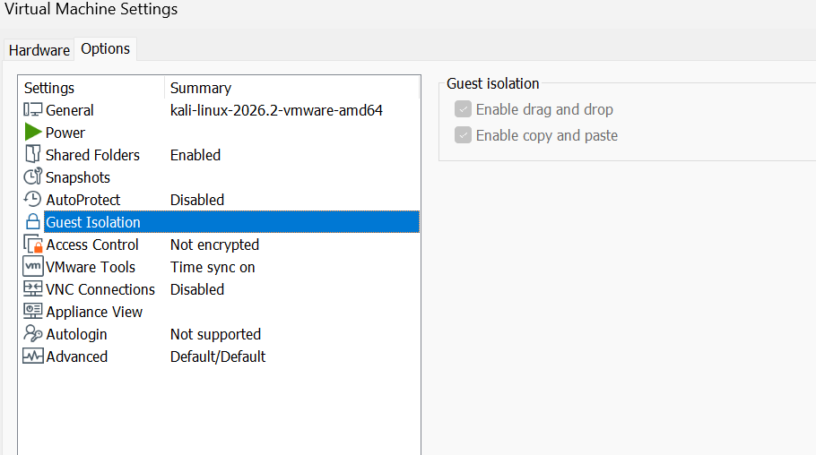
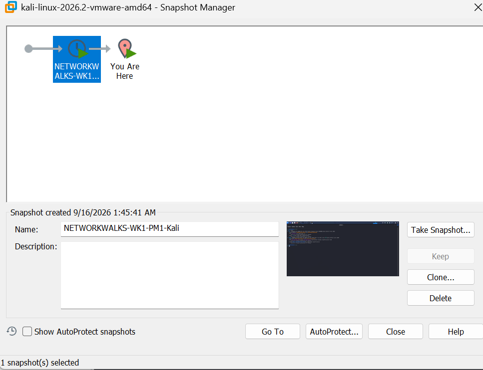

<div align="center">

# 🔐 Cybersecurity Lab Environment Setup

**Building a controlled virtual lab environment for cybersecurity testing and ethical hacking practice**

</div>

<p align="center">
  
  
  
  
  
  
  
  
  
  
  
  
  
</p>

---

## 📌 Project Overview

This project was completed as part of the **NETWORKWALKS Cybersecurity Internship – WK1-PM1**.

The objective was to set up a controlled cybersecurity testing environment using **VMware Workstation Pro** and **Kali Linux**, with networking, Internet connectivity, shared-folder access, clipboard/drag-and-drop functionality, and a recovery snapshot configured and tested.

> **Lab Platform:** VMware Workstation Pro
> **Security VM:** Kali Linux
> **Network:** VMware VMnet8 NAT
> **Kali IP:** `192.168.80.131/24`


# 🔐 Cybersecurity Lab Environment Setup

A practical cybersecurity testing lab setup completed as part of the **NETWORKWALKS Cybersecurity Internship – Week 01, Project 01**.

## 📌 Project Overview

This project focused on preparing a controlled cybersecurity testing environment using **VMware Workstation Pro** and **Kali Linux**.

The lab provides a dedicated environment for practicing cybersecurity concepts such as network security, reconnaissance, vulnerability assessment, penetration testing, and security operations without modifying the existing host environment.

The setup includes Kali Linux networking, Internet connectivity verification, VMware shared folders, clipboard and drag-and-drop integration, and a VM snapshot for recovery.

## 🎯 Objectives

The main objectives of this project were to:

* Configure a Kali Linux cybersecurity testing VM.
* Configure VMware virtual networking.
* Verify Kali Linux IP addressing.
* Confirm Internet connectivity.
* Configure and test a shared folder.
* Enable clipboard and drag-and-drop functionality.
* Create a clean VM snapshot for recovery.
* Document the complete lab setup with screenshots.

## 🧰 Lab Environment

| Component      | Configuration               |
| -------------- | --------------------------- |
| Host OS        | Windows 11 Pro              |
| Hypervisor     | VMware Workstation Pro      |
| Security VM    | Kali Linux                  |
| Network Type   | VMware VMnet8 NAT           |
| Network Subnet | `192.168.80.0/24`           |
| Kali IP        | `192.168.80.131/24`         |
| Shared Folder  | `downloads`                 |
| Mount Point    | `/mnt/hgfs/downloads`       |
| Snapshot       | `NETWORKWALKS-WK1-PM1-Kali` |

> **Note:** The provided project instructions describe a `10.0.0.0/24` NAT Network and `10.0.0.2` Kali address. VMware Workstation was used for this implementation because VMware was permitted for the internship task. The existing VMware NAT configuration was retained rather than modifying the existing cybersecurity lab environment.

## 🪜 Lab Setup Procedure

### 1. Kali Linux Virtual Machine

The existing Kali Linux virtual machine was used as the cybersecurity testing machine.



### 2. VMware Network Adapter Configuration

The Kali VM was connected to the existing VMware **VMnet8 NAT** network.



### 3. Verify Kali Linux IP Address

The Kali network interface was checked using:

```bash
ip addr
```

The Kali VM received the following IPv4 address:

```text
192.168.80.131/24
```



### 4. Internet Connectivity Test

Internet connectivity was verified from Kali Linux using:

```bash
ping -c 4 google.com
```

The test completed successfully with **0% packet loss**.



### 5. VMware Shared Folder

A VMware shared folder named:

```text
downloads
```

was configured for file sharing between the host system and Kali Linux.



### 6. Access Shared Folder from Kali

The shared folder was made accessible inside Kali Linux at:

```text
/mnt/hgfs/downloads
```

The VMware shared-folder configuration was verified using:

```bash
vmware-hgfsclient
```

The folder was then mounted using VMware's HGFS filesystem.



### 7. Clipboard and Drag & Drop

Clipboard sharing and drag-and-drop functionality were enabled and tested between the host system and Kali Linux.



### 8. Create VM Snapshot

After completing the configuration and verification, a recovery snapshot was created.

Snapshot name:

```text
NETWORKWALKS-WK1-PM1-Kali
```

This provides a known-good recovery point before performing future cybersecurity experiments.



## 🧪 Verification Summary

| Test                           | Result      |
| ------------------------------ | ----------- |
| Kali VM configured             | ✅ Completed |
| VMware NAT networking          | ✅ Verified  |
| Kali IP address                | ✅ Verified  |
| Internet connectivity          | ✅ Passed    |
| Shared folder configuration    | ✅ Completed |
| Shared folder access from Kali | ✅ Verified  |
| Clipboard & Drag/Drop          | ✅ Tested    |
| Recovery snapshot              | ✅ Created   |

## 🐛 Troubleshooting Experience

### Issue: VMware Shared Folder Not Immediately Accessible

During the setup, the `downloads` shared folder was configured in VMware, but the `/mnt/hgfs` directory was not initially available inside Kali Linux.

### Solution

First, the available VMware shared folders were checked:

```bash
vmware-hgfsclient
```

The following folder was returned:

```text
downloads
```

A mount point was then created:

```bash
sudo mkdir -p /mnt/hgfs/downloads
```

The shared folder was mounted using:

```bash
sudo mount -t fuse.vmhgfs-fuse .host:/downloads /mnt/hgfs/downloads -o allow_other
```

The folder was then verified:

```bash
ls -la /mnt/hgfs/downloads
```

This confirmed that the VMware shared folder was accessible from Kali Linux.

## 📚 Key Learnings

### Virtualization

I learned how virtualization can be used to create a dedicated environment for cybersecurity testing and experimentation.

### Virtual Networking

I gained practical experience with VMware NAT networking and learned how the virtual network connects the Kali VM to external network access.

### Linux Networking

I practiced checking network configuration and connectivity using commands such as:

```bash
ip addr
ping
```

### Shared Folders

I learned how VMware shared folders can be configured and mounted inside Kali Linux for controlled file exchange between the host and virtual machine.

### Snapshots

I learned the importance of creating a clean snapshot before performing cybersecurity experiments. A snapshot provides a recovery point that can be restored if a future experiment changes the VM.

### Troubleshooting

The shared-folder issue provided practical experience in identifying a configuration problem, checking the available VMware shared folders, creating the required mount point, mounting the filesystem, and verifying access.

## 🔐 Security & Ethical Use

This laboratory is intended for authorized cybersecurity education, testing, and experimentation only.

Security testing should only be performed against systems that are owned by the user or where explicit permission has been provided.

## 🚀 Future Expansion

This lab can later be expanded with additional virtual machines and security-testing environments, including:

* Windows target machines
* Vulnerable Linux systems
* Web application targets
* Network monitoring tools
* Vulnerability assessment tools
* SOC monitoring and detection environments
* Additional cybersecurity testing scenarios

## 👤 Author

**Saqlain Abbas**

Cybersecurity Intern – NETWORKWALKS

GitHub: **Saqlain-Soc**

## 📌 Project Information

**Program:** Cybersecurity Internship at NETWORKWALKS
**Week:** 01
**Project:** WK1-PM1 – Cybersecurity Lab Setup
**Platform:** VMware Workstation Pro
**Security VM:** Kali Linux
