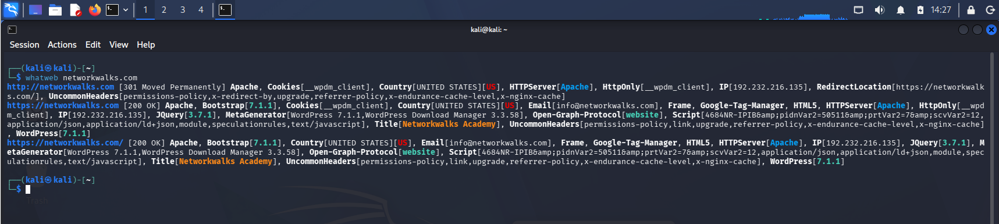
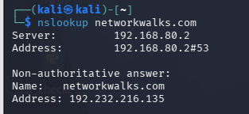
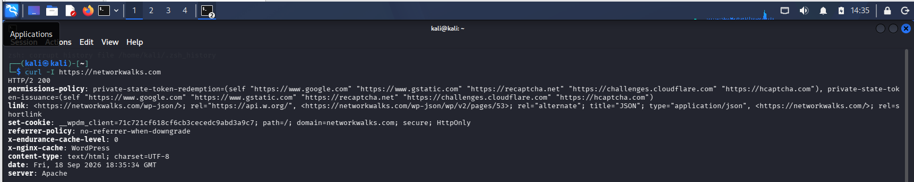
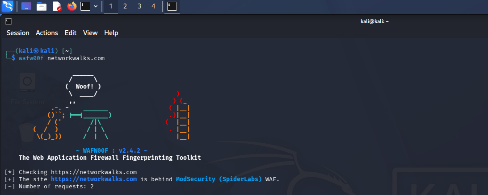
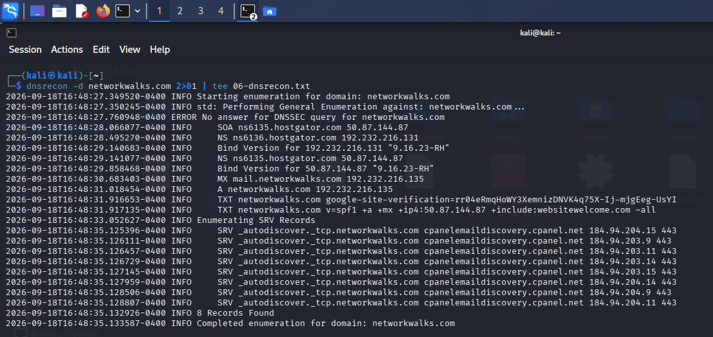

# Footprinting & Reconnaissance Report


Passive reconnaissance against a live target using six built-in Kali Linux tools.

*NetworkWalks Cybersecurity Internship — Week 02, PM1*

---

## Assessment Overview

| Field | Details |
|---|---|
| Intern | Saqlain Abbas |
| Program | NetworkWalks Cybersecurity Internship |
| Module | Week 02 — PM1: Footprinting & Reconnaissance |
| Target | networkwalks.com |
| Lab Environment | Kali Linux (VMware VMnet8 NAT) |
| Authorization | Authorized internship task |
| Status | Completed |

---

## Disclaimer

All activities were performed for educational purposes as part of an authorized internship task on the live website `networkwalks.com`, as instructed by NetworkWalks. No unauthorized systems or devices were targeted.

---

## Introduction

This report covers passive reconnaissance (footprinting) performed against `networkwalks.com` using six built-in Kali Linux tools. The objective was to gather publicly available information without directly interacting with or exploiting the target — domain ownership, web technologies, DNS infrastructure, HTTP headers, and WAF presence.

---

## Tools Used

| Tool | Purpose |
|---|---|
| whois | Domain registration details |
| whatweb | Web technology fingerprinting |
| nslookup | DNS resolution |
| curl -I | HTTP response header extraction |
| wafw00f | Web Application Firewall detection |
| dnsrecon | DNS record enumeration |

---

## Tasks Completed

### 1. whois

**Command:**
```bash
whois networkwalks.com
```

**Key findings:**

| Field | Value |
|---|---|
| Registrar | GoDaddy.com, LLC |
| Creation Date | 2019-11-06 |
| Expiry Date | 2027-11-06 |
| Name Servers | NS6135.HOSTGATOR.COM, NS6136.HOSTGATOR.COM |
| Registrant | Privacy Protected (Domains By Proxy) |

**Evidence:**


Raw output: [01-whois.txt](01-whois.txt)

---

### 2. whatweb

**Command:**
```bash
whatweb networkwalks.com
```

**Key findings:**

| Field | Value |
|---|---|
| Web Server | Apache |
| CMS | WordPress 7.1.1 |
| Plugin | WordPress Download Manager 3.3.58 |
| Frameworks | Bootstrap 7.1.1, jQuery 3.7.1 |
| IP Address | 192.232.216.135 |
| Email | info@networkwalks.com |
| Country | United States |

**Evidence:**



Raw output: [02-whatweb.txt](02-whatweb.txt)

---

### 3. nslookup

**Command:**
```bash
nslookup networkwalks.com
```

**Key findings:**

| Field | Value |
|---|---|
| Resolved IP | 192.232.216.135 |

**Evidence:**



Raw output: [03-nslookup.txt](03-nslookup.txt)

---

### 4. curl -I

**Command:**
```bash
curl -I https://networkwalks.com
```

**Key findings:**

| Field | Value |
|---|---|
| HTTP Status | 200 OK |
| Server | Apache |
| REST API Endpoint | /wp-json/ |
| Caching | x-nginx-cache |
| Cookie | __wpdm_client |

**Evidence:**



Raw output: [04-curl.txt](04-curl.txt)

---

### 5. wafw00f

**Command:**
```bash
wafw00f networkwalks.com
```

**Key findings:**

| Field | Value |
|---|---|
| WAF Detected | ModSecurity (SpiderLabs) |

**Evidence:**



Raw output: [05-wafw00f.txt](05-wafw00f.txt)

---

### 6. dnsrecon

**Command:**
```bash
dnsrecon -d networkwalks.com
```

**Key findings:**

| Field | Value |
|---|---|
| Name Servers | ns6135.hostgator.com, ns6136.hostgator.com |
| Mail Server (MX) | mail.networkwalks.com → 192.232.216.135 |
| Bind Version | 9.16.23-RH |
| SPF Record | Present |
| SRV Records | Multiple, for cPanel email discovery |

**Evidence:**



Raw output: [06-dnsrecon.txt](06-dnsrecon.txt)

---

## Summary of Reconnaissance Results

| Information | Value |
|---|---|
| Domain IP | 192.232.216.135 |
| Web Server | Apache |
| CMS | WordPress 7.1.1 |
| Plugin | WP Download Manager 3.3.58 |
| WAF | ModSecurity (SpiderLabs) |
| Hosting Provider | HostGator |
| Registrar | GoDaddy |
| Mail Server | mail.networkwalks.com |

---

## Key Learnings

- Passive reconnaissance only uses publicly available information — no direct interaction with the target's defenses.
- `whois` and DNS tools reveal ownership, hosting, and mail infrastructure.
- `whatweb` and `curl` help fingerprint exact software versions for later vulnerability research.
- `wafw00f` tells whether a firewall is protecting the target, shaping later testing strategy.
- All information gathered here becomes the foundation for later scanning and attack planning.

---

## Conclusion

During Week 02 of the NetworkWalks Cybersecurity Internship, I performed structured passive reconnaissance against `networkwalks.com` using six Kali Linux tools. The assessment successfully mapped the target's hosting, DNS, CMS, and WAF posture without any direct exploitation, strengthening my understanding of the information-gathering phase of an authorized security assessment.

---

## Evidence Index

| # | File | Description |
|---|---|---|
| 1 | `01-whois.png` / `01-whois.txt` | whois domain registration lookup |
| 2 | `02-whatweb.png` / `02-whatweb.txt` | whatweb technology fingerprint |
| 3 | `03-nslookup.png` / `03-nslookup.txt` | nslookup DNS resolution |
| 4 | `04-curl.png` / `04-curl.txt` | curl HTTP header extraction |
| 5 | `05-wafw00f.png` / `05-wafw00f.txt` | wafw00f WAF detection |
| 6 | `06-dnsrecon.png` / `06-dnsrecon.txt` | dnsrecon DNS enumeration |

---

## Author

**Saqlain Abbas**
Cybersecurity Intern — NetworkWalks

<p align="left">
  <a href="https://github.com/Saqlain-Soc">
    
  </a>
  &nbsp;
  <a href="https://linkedin.com/in/saqlain-abbas-498516345">
    
  </a>
</p>
