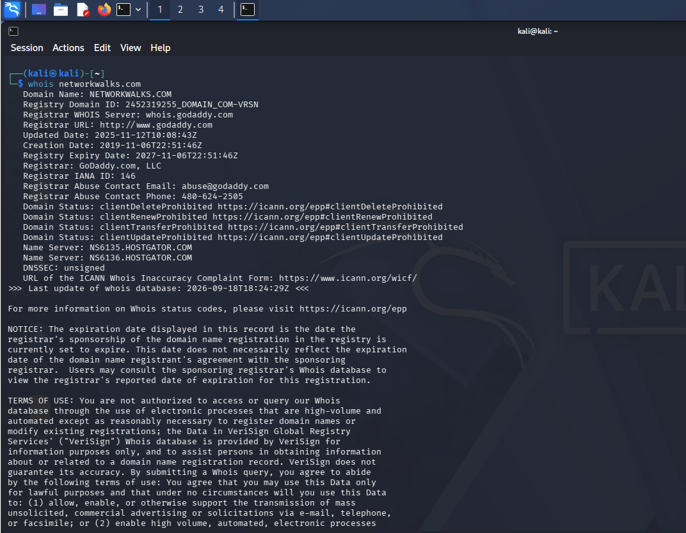

# 🔎 FOOTPRINTING & RECONNAISSANCE REPORT


Passive Reconnaissance Using Multiple Kali Linux Tools

*WEEK 02 | PM1 | FOOTPRINTING & RECONNAISSANCE*

---

## 🔹 Assessment Overview

| **Field** | **Details** |
| :--- | :--- |
| 👨‍💻 **Intern** | **Saqlain Abbas** |
| 🎓 **Program / Batch** | **NETWORKWALKS Cybersecurity Internship** |
| 🧪 **Module** | **Week 02 — PM1: Footprinting & Reconnaissance** |
| 🎯 **Target** | **networkwalks.com** |
| 🖥️ **Lab Environment** | **Kali Linux (VMware VMnet8 NAT)** |
| 🔐 **Authorization** | ✅ **Authorized Internship Task** |
| 📌 **Assessment Type** | **Passive Reconnaissance (Footprinting)** |
| ✅ **Status** | **Completed** |

---

## 1. ⚠️ Liability Disclaimer

All activities were performed for educational purposes as part of an authorized internship task on the live website **networkwalks.com**, as instructed by NETWORKWALKS. No unauthorized systems or devices were targeted. All testing remained within permitted scope.

---

## 2. 📖 Introduction

This report covers **passive reconnaissance (footprinting)** performed against the target domain `networkwalks.com` using six built-in Kali Linux tools. The objective was to gather publicly available information without directly interacting with or exploiting the target — domain ownership, web technologies, DNS infrastructure, HTTP headers, and WAF presence.

---

## 🛠️ 3. Tools Used

| **Tool** | **Purpose** |
| :--- | :--- |
| 🔎 **whois** | Domain registration details |
| 🌐 **whatweb** | Web technology fingerprinting |
| 📡 **nslookup** | DNS resolution |
| 📄 **curl -I** | HTTP response header extraction |
| 🛡️ **wafw00f** | Web Application Firewall detection |
| 🗂️ **dnsrecon** | DNS record enumeration |

---

## 🔍 4. Tasks Completed

### 4.1 — whois

**Command executed:**
```bash
whois networkwalks.com
```

**Key Findings:**

| **Field** | **Value** |
| :--- | :--- |
| Registrar | GoDaddy.com, LLC |
| Creation Date | 2019-11-06 |
| Expiry Date | 2027-11-06 |
| Name Servers | NS6135.HOSTGATOR.COM, NS6136.HOSTGATOR.COM |
| Registrant | Privacy Protected (Domains By Proxy) |

**📸 Evidence:** `01-whois.png` · `01-whois.txt`



### 4.2 — whatweb

**Command executed:**
```bash
whatweb networkwalks.com
```

**Key Findings:**

| **Field** | **Value** |
| :--- | :--- |
| Web Server | Apache |
| CMS | WordPress 7.1.1 |
| Plugin | WordPress Download Manager 3.3.58 |
| Frameworks | Bootstrap 7.1.1, jQuery 3.7.1 |
| IP Address | 192.232.216.135 |
| Email | info@networkwalks.com |
| Country | United States |

**📸 Evidence:** `02-whatweb.png` · `02-whatweb.txt`

---

### 4.3 — nslookup

**Command executed:**
```bash
nslookup networkwalks.com
```

**Key Findings:**

| **Field** | **Value** |
| :--- | :--- |
| Resolved IP | 192.232.216.135 |

**📸 Evidence:** `03-nslookup.png` · `03-nslookup.txt`

---

### 4.4 — curl -I

**Command executed:**
```bash
curl -I https://networkwalks.com
```

**Key Findings:**

| **Field** | **Value** |
| :--- | :--- |
| HTTP Status | 200 OK |
| Server | Apache |
| REST API Endpoint | /wp-json/ |
| Caching | x-nginx-cache |
| Cookie | __wpdm_client |

**📸 Evidence:** `04-curl.png` · `04-curl.txt`

---

### 4.5 — wafw00f

**Command executed:**
```bash
wafw00f networkwalks.com
```

**Key Findings:**

| **Field** | **Value** |
| :--- | :--- |
| WAF Detected | ModSecurity (SpiderLabs) |

**📸 Evidence:** `05-wafw00f.png` · `05-wafw00f.txt`

---

### 4.6 — dnsrecon

**Command executed:**
```bash
dnsrecon -d networkwalks.com
```

**Key Findings:**

| **Field** | **Value** |
| :--- | :--- |
| Name Servers | ns6135.hostgator.com, ns6136.hostgator.com |
| Mail Server (MX) | mail.networkwalks.com → 192.232.216.135 |
| Bind Version | 9.16.23-RH |
| SPF Record | Present |
| SRV Records | Multiple, for cPanel email discovery |

**📸 Evidence:** `06-dnsrecon.png`

---

## 📊 5. Summary of Reconnaissance Results

| **Information** | **Value** |
| :--- | :--- |
| **Domain IP** | 192.232.216.135 |
| **Web Server** | Apache |
| **CMS** | WordPress 7.1.1 |
| **Plugin** | WP Download Manager 3.3.58 |
| **WAF** | ModSecurity (SpiderLabs) |
| **Hosting Provider** | HostGator |
| **Registrar** | GoDaddy |
| **Mail Server** | mail.networkwalks.com |

---

## 🧠 6. Key Learnings

* Passive reconnaissance only uses **publicly available information** — no direct interaction with the target's defenses.
* `whois` + DNS tools reveal **ownership, hosting, and mail infrastructure**.
* `whatweb` and `curl` help fingerprint **exact software versions** for later vulnerability research.
* `wafw00f` tells whether a **firewall is protecting** the target, shaping later testing strategy.
* All information gathered here becomes the **foundation for later scanning and attack planning**.

---

## ✅ 7. Conclusion

During Week 02 of the NETWORKWALKS Cybersecurity Internship, I performed structured passive reconnaissance against `networkwalks.com` using six Kali Linux tools. The assessment successfully mapped the target's hosting, DNS, CMS, and WAF posture without any direct exploitation, strengthening my understanding of the **information-gathering phase** of an authorized security assessment.

---

## 📊 8. Project Summary

| **Category** | **Details** |
| :--- | :--- |
| **Project** | NETWORKWALKS Internship — Week 02, PM1 |
| **Focus** | Footprinting & Reconnaissance |
| **Target** | networkwalks.com |
| **Tools Used** | 6 (whois, whatweb, nslookup, curl, wafw00f, dnsrecon) |
| **Status** | **Completed** |

---

## 👤 Author

### Saqlain Abbas

**🔐 Cybersecurity Intern — NETWORKWALKS**

> `Learning → Building → Testing → Securing`

This repository forms part of my practical cybersecurity internship portfolio and documents my hands-on reconnaissance exercises.

<p align="center">
  <a href="https://linkedin.com/in/saqlain-abbas-a61b59414">
    
  </a>
  &nbsp;
  <a href="https://github.com/Saqlain-Soc">
    
  </a>
</p>

---
