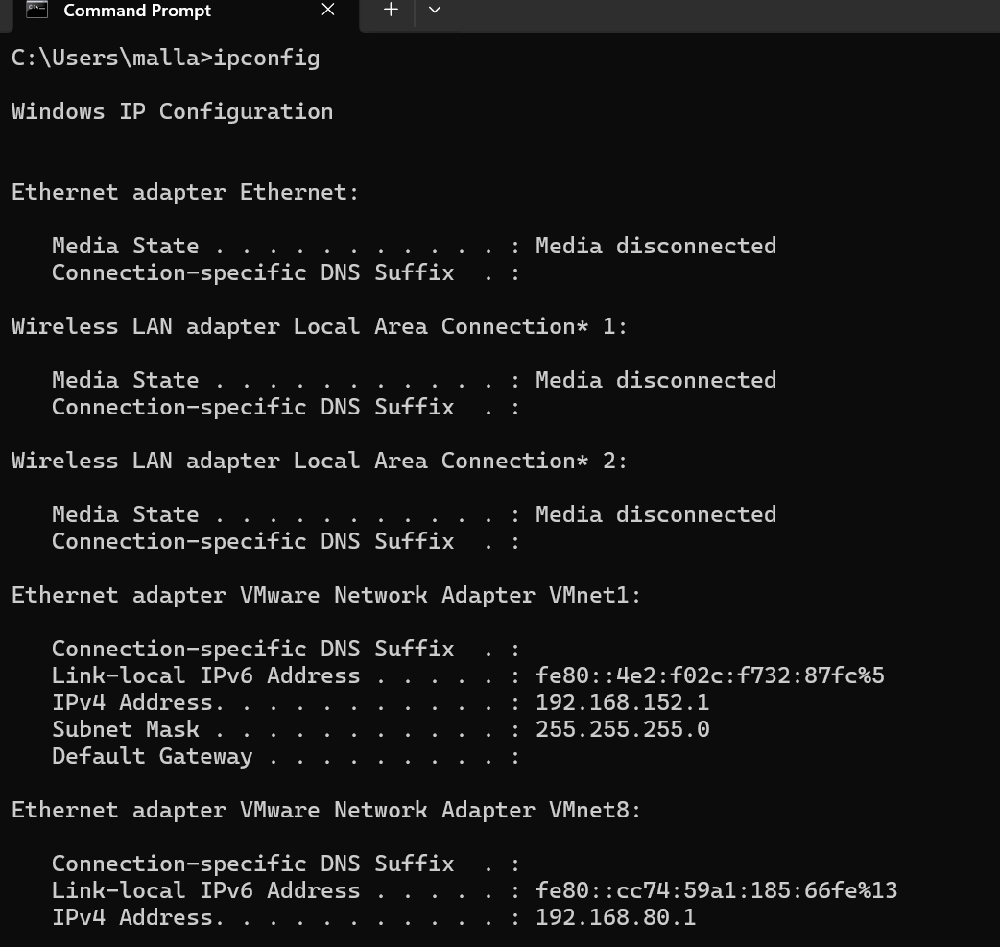
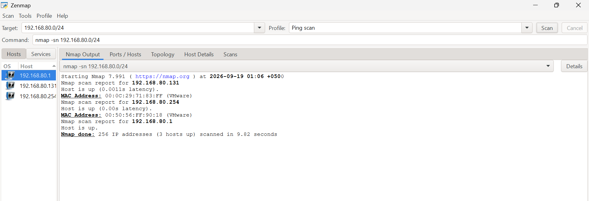
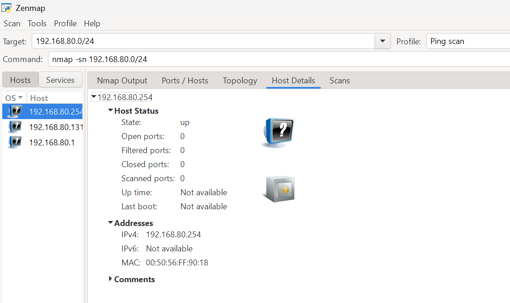
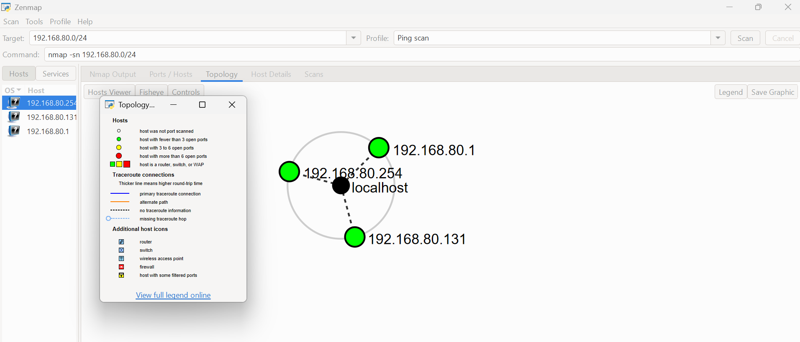

# Network Scanning Report


Network scanning and host discovery using Zenmap.

*NetworkWalks Cybersecurity Internship — Week 02, PM5*

---

## Assessment Overview

| Field | Details |
|---|---|
| Intern | Saqlain Abbas |
| Program | NetworkWalks Cybersecurity Internship |
| Module | Week 02 — PM5: Network Scanning with Zenmap |
| Target Subnet | 192.168.80.0/24 (VMware VMnet8 NAT) |
| Authorization | Authorized internship task |
| Phase | Scanning & network discovery |
| Status | Completed |

---

## Disclaimer

All activities were performed for educational purposes on my own local VMware NAT network (`192.168.80.0/24`), which is entirely under my control. No external or unauthorized networks were scanned.

---

## Introduction

This report covers network scanning and host discovery using Zenmap (the GUI for Nmap) as part of Week 02 of the NetworkWalks Cybersecurity Internship. The objective was to install Zenmap on Windows, identify the local subnet, and perform authorized host discovery to identify active devices on the network.

---

## Tools Used

| Tool | Purpose |
|---|---|
| Windows CMD | Identify local network configuration |
| Zenmap (Nmap GUI) | Discover live hosts and network devices |

---

## Lab Environment

| Component | Details |
|---|---|
| Host OS | Windows |
| Hypervisor | VMware Workstation |
| Network | VMware VMnet8 NAT |
| Subnet | 192.168.80.0/24 |
| Gateway | 192.168.80.1 |
| Kali Linux IP | 192.168.80.131 |

---

## Tasks Completed

### 1. Zenmap Installation

Zenmap was downloaded from the official source ([nmap.org/download.html](https://nmap.org/download.html)) and installed successfully on Windows.

---

### 2. Local IP & Subnet Identification

**Command:**
```cmd
ipconfig
```

**Result:**

| Field | Value |
|---|---|
| VMware Network Adapter | VMnet8 → 192.168.80.1 |
| Subnet Mask | 255.255.255.0 |
| Target Subnet | 192.168.80.0/24 |

**Evidence:**



---

### 3. Live Host Discovery

| Field | Value |
|---|---|
| Target | 192.168.80.0/24 |
| Profile | Ping scan |
| Command | `nmap -sn 192.168.80.0/24` |
| Live Hosts Found | 3 |

**Evidence:**



---

### 4. IP Addresses of Live Hosts

| IP Address | Role |
|:---:|---|
| 192.168.80.1 | Gateway / Host |
| 192.168.80.131 | Kali Linux VM |
| 192.168.80.254 | VMware Virtual Host |

---

### 5. MAC Addresses of Live Hosts

| IP Address | MAC Address | Vendor |
|:---:|:---:|---|
| 192.168.80.131 | 00:0C:29:71:83:FF | VMware |
| 192.168.80.254 | 00:50:56:FF:90:18 | VMware |
| 192.168.80.1 | (Gateway) | — |

**Evidence:**



---

### 6. Network Topology

The topology view was generated and saved as a PDF.

**Evidence:**



Full topology export: [Topology.pdf](Topology.pdf)

---

## Summary

| Item | Result |
|---|---|
| Live Hosts | 3 |
| Live IPs | 192.168.80.1, .131, .254 |
| Scan Duration | ~9.82 seconds |
| Topology Saved | Yes (PDF) |

---

## Key Learnings

- Zenmap makes Nmap easier to use through a graphical interface.
- Ping scan (`-sn`) is useful for quick host discovery without port scanning.
- MAC addresses help identify virtual machines (VMware vendor prefixes).
- Topology view gives a visual map of the network layout.
- Scanning should always be limited to your own authorized lab network.

---

## Conclusion

During Week 02 of the NetworkWalks Cybersecurity Internship, I used Zenmap/Nmap to perform network discovery on my local VMware NAT subnet. The scan identified 3 live hosts and provided details such as IP addresses, MAC addresses, and network topology. This practical strengthened my understanding of host discovery, network mapping, and the scanning phase of an authorized security assessment.

---

## Evidence Index

| # | File | Description |
|---|---|---|
| 1 | `01-ipconfig.png` | Local IP/subnet identification via CMD |
| 2 | `02-zenmap-ping-scan.png` | Zenmap ping scan results |
| 3 | `03-hosts-list.png` | IP/MAC address list of live hosts |
| 4 | `04-topology.png` | Network topology view |
| 5 | `Topology.pdf` | Full topology export |

---

## Author

**Saqlain Abbas**
Cybersecurity Intern — NetworkWalks

<p align="left">
  <a href="https://github.com/Saqlain-Soc">
    
  </a>
  &nbsp;
  <a href="https://linkedin.com/in/saqlain-abbas-498516345">
    
  </a>
</p>
