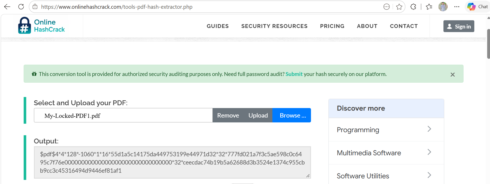
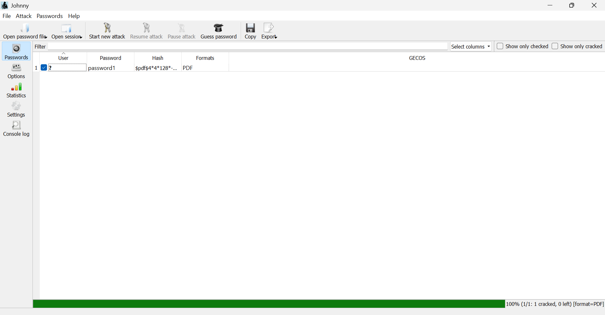
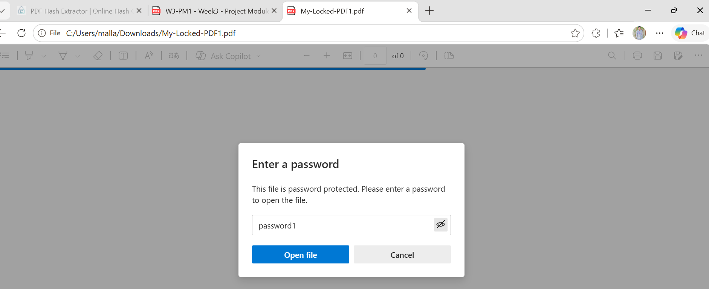
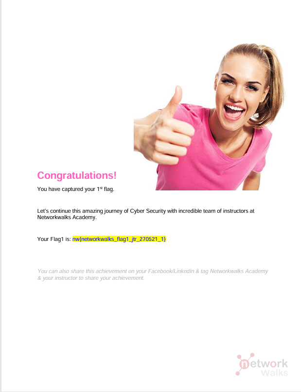

# Password Cracking with JTR (John the Ripper)

Recovering a password-protected PDF's password using John the Ripper (JTR) and its Johnny GUI.

*NetworkWalks Cybersecurity Internship — Week 03, PM1*

---

## Assessment Overview

| Field | Details |
|---|---|
| Intern | Saqlain Abbas |
| Program | NetworkWalks Cybersecurity Internship |
| Module | Week 03 — PM1: Password Cracking with JTR |
| Target File | My-Locked-PDF1.pdf |
| Lab Environment | Windows PC |
| Authorization | Authorized internship task |
| Status | Completed |

---

## Disclaimer

All activities were performed for educational purposes as part of an authorized internship task, on a PDF file provided by NetworkWalks specifically for this lab. No unauthorized files, systems, or accounts were targeted.

---

## Introduction

John the Ripper (JTR) is a widely used password cracking tool used by security professionals to test how strong a password is. It supports many hash types and can recover passwords from protected files such as PDF, ZIP, and Office documents. Johnny is the graphical front-end for JTR, allowing the same attacks to be run without typing commands directly.

The objective of this task was to recover the password of a protected PDF file (`My-Locked-PDF1.pdf`) by extracting its crackable hash and running a dictionary attack against it using JTR/Johnny.

---

## Tools Used

| Tool | Purpose |
|---|---|
| Online PDF Hash Extractor | Extract a crackable ($pdf$...) hash from the locked PDF |
| John the Ripper (core engine) | Password cracking engine |
| Johnny | Graphical front-end for John the Ripper |

---

## Tasks Completed

### 1. Extracting the PDF Hash

**Tool used:** [onlinehashcrack.com — PDF Hash Extractor](https://www.onlinehashcrack.com/tools-pdf-hash-extractor.php)

The locked PDF (`My-Locked-PDF1.pdf`) was uploaded to the hash extractor, which returned a crackable hash in `$pdf$...` format (pdf2john-compatible), ready to be fed into JTR.

**Evidence:**

---

### 2. Saving the Hash & Running the Attack in Johnny

The extracted hash was saved into a `.txt` file and loaded into Johnny using **Open password file**. The attack was started with **Start new attack**, and John the Ripper completed the crack in a single pass against the built-in wordlist.

**Result:** Password cracked — `password1`

| Field | Value |
|---|---|
| Hash format | PDF |
| Passwords tried | 1/1 |
| Cracked | 1 |
| Progress | 100% |

**Evidence:**

---

### 3. Unlocking the PDF

The cracked password (`password1`) was entered into the PDF's password prompt to confirm it was correct and to open the protected file.

**Evidence:**

---

### 4. Flag Captured

Opening the file confirmed successful completion of the lab and revealed the internship flag for this task.

**Flag:** `nw{networkwalks_flag1_jtr_270521_1}`

**Evidence:**

---

## Summary

| Item | Result |
|---|---|
| Target File | My-Locked-PDF1.pdf |
| Hash Format | $pdf$ (pdf2john / hashcat-compatible) |
| Cracking Tool | John the Ripper via Johnny GUI |
| Cracked Password | password1 |
| Flag Captured | nw{networkwalks_flag1_jtr_270521_1} |
| Status | Completed |

---

## Key Learnings

- Password-protected PDFs store their password as a hash, not in plain text — recovering it requires extracting that hash first.
- John the Ripper's core engine does the actual cracking; Johnny simply provides a graphical way to drive it without memorizing command-line syntax.
- A weak, dictionary-word password (`password1`) can be cracked almost instantly — reinforcing why strong, unique passwords matter even for "just a file."
- The same hash-extraction-then-crack workflow applies across many protected file types (PDF, ZIP, Office documents), not just PDFs.

---

## Conclusion

During Week 03 of the NetworkWalks Cybersecurity Internship, I used John the Ripper and its Johnny GUI to recover the password of a protected PDF file. The exercise walked through the full password-cracking workflow — hash extraction, dictionary attack, and verification — and reinforced why weak passwords remain one of the easiest entry points for attackers.

---

## Evidence Index

| # | File | Description |
|---|---|---|
| 1 | `01-hash-extracted.png` | PDF hash extracted in $pdf$ (pdf2john) format |
| 2 | `02-johnny-cracked-password.png` | Johnny GUI — password cracked (password1) |
| 3 | `03-pdf-unlocked.png` | Cracked password entered, PDF unlocked |
| 4 | `04-flag-captured.png` | Internship flag captured on successful completion |

---

## Author

**Saqlain Abbas**
Cybersecurity Intern — NetworkWalks

  
  &nbsp;
  

