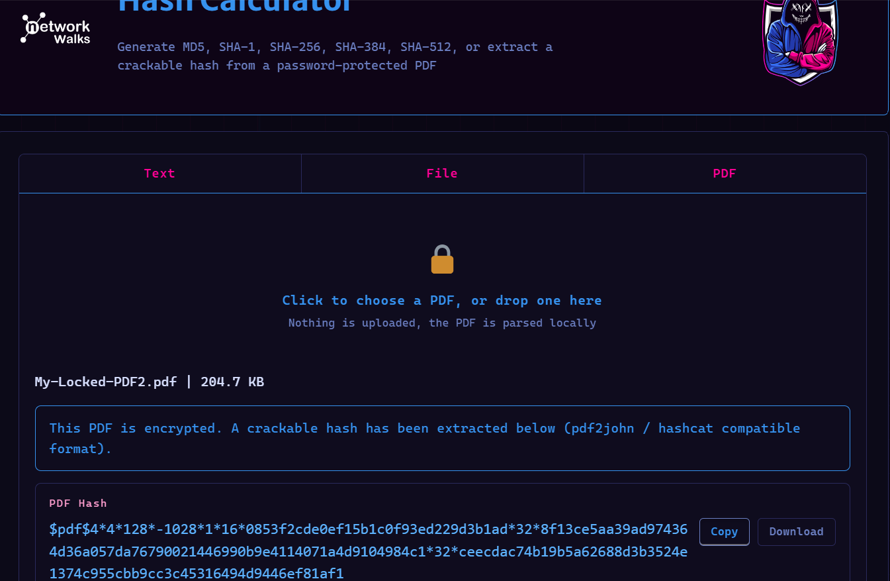
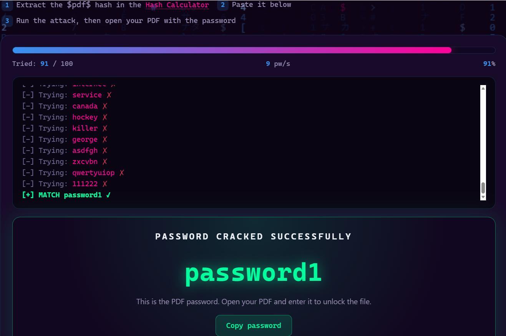

# Password Cracking with NetworkWalks Tools

Recovering a password-protected PDF's password using the NetworkWalks Hash Calculator and Password Cracker web tools.

*NetworkWalks Cybersecurity Internship — Week 03, PM2*

---

## Assessment Overview

| Field | Details |
|---|---|
| Intern | Saqlain Abbas |
| Program | NetworkWalks Cybersecurity Internship |
| Module | Week 03 — PM2: Password Cracking with NetworkWalks Tools |
| Target File | My-Locked-PDF2.pdf |
| Lab Environment | Browser-based (Windows) |
| Authorization | Authorized internship task |
| Status | Completed |

---

## Disclaimer

All activities were performed for educational purposes as part of an authorized internship task, on a PDF file provided by NetworkWalks specifically for this lab. No unauthorized files, systems, or accounts were targeted.

---

## Introduction

This task used two free, browser-based tools built by NetworkWalks — the **Hash Calculator** and the **Password Cracker** — to recover the password of a second protected PDF file (`My-Locked-PDF2.pdf`). Unlike PM1, no software installation was required; both tools run entirely client-side in the browser.

The objective was to extract the PDF's crackable hash, run a dictionary attack against it using the Password Cracker, and confirm the recovered password by unlocking the file.

---

## Tools Used

| Tool | Purpose |
|---|---|
| NetworkWalks Hash Calculator | Extracts a crackable ($pdf$...) hash from a password-protected PDF, entirely in-browser |
| NetworkWalks Password Cracker | Runs a dictionary attack against the extracted hash |

---

## Tasks Completed

### 1. Extracting the PDF Hash

**Tool used:** [networkwalks.com/hash-calculator](https://networkwalks.com/hash-calculator/) — PDF tab

`My-Locked-PDF2.pdf` (204.7 KB) was uploaded directly to the Hash Calculator. The tool parsed the file locally in-browser and confirmed it was encrypted, extracting a crackable hash in `$pdf$...` (pdf2john / hashcat-compatible) format.

**Evidence:**

---

### 2. Running the Dictionary Attack

**Tool used:** [networkwalks.com/password-cracker](https://networkwalks.com/password-cracker/)

The extracted hash was pasted into the Password Cracker, which ran a dictionary attack against its built-in 100-password wordlist. After 91 attempts (91% progress, ~9 passwords/second), the tool found a match.

**Result:** Password cracked — `password1`

| Field | Value |
|---|---|
| Wordlist | Built-in list (100 passwords) |
| Attempts before match | 91 / 100 |
| Speed | ~9 pw/s |
| Cracked Password | password1 |

**Evidence:**

---

### 3. Flag Captured

Entering the cracked password into `My-Locked-PDF2.pdf` unlocked the file and revealed the internship flag for this task.

**Flag:** `nw{networkwalks_persistence_jtr_270521}`

**Evidence:**

---

## Summary

| Item | Result |
|---|---|
| Target File | My-Locked-PDF2.pdf |
| Hash Format | $pdf$ (pdf2john / hashcat-compatible) |
| Cracking Tool | NetworkWalks Password Cracker (dictionary attack) |
| Cracked Password | password1 |
| Flag Captured | nw{networkwalks_persistence_jtr_270521} |
| Status | Completed |

---

## Key Learnings

- The same hash-then-crack workflow used with John the Ripper in PM1 can be reproduced entirely in-browser, with no software installation.
- Browser-based tools that parse files locally (rather than uploading them to a server) offer a lower-friction way to practice the same fundamentals.
- A dictionary attack only needs to try a fraction of a small wordlist to break a weak, predictable password like `password1` — reinforcing the same lesson as PM1 from a different angle.
- Comparing PM1 (JTR/Johnny) and PM2 (NetworkWalks tools) side by side shows that the underlying concept — extract hash, attack hash, verify password — stays constant across different tools.

---

## Conclusion

During Week 03 of the NetworkWalks Cybersecurity Internship, I used the NetworkWalks Hash Calculator and Password Cracker to recover the password of a second protected PDF file, entirely through the browser. Completing this alongside the JTR-based PM1 task reinforced the same password-cracking fundamentals through two different toolsets — one installed, one browser-based — and further highlighted how quickly weak passwords fall to basic dictionary attacks.

---

## Evidence Index

| # | File | Description |
|---|---|---|
| 1 | `01-hash-extracted.png` | NetworkWalks Hash Calculator — PDF hash extracted |
| 2 | `02-password-cracked.png` | NetworkWalks Password Cracker — password1 cracked |
| 3 | `03-flag-captured.png` | Internship flag captured on successful completion |

---

## Author

**Saqlain Abbas**
Cybersecurity Intern — NetworkWalks

  
  &nbsp;
  

